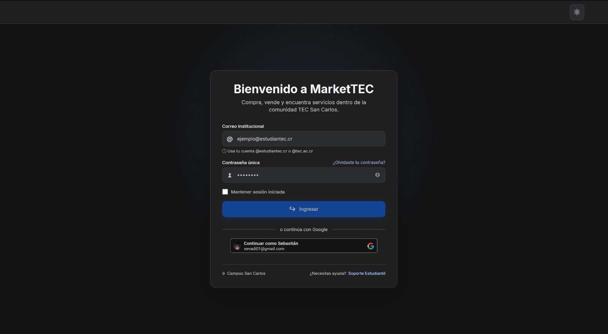
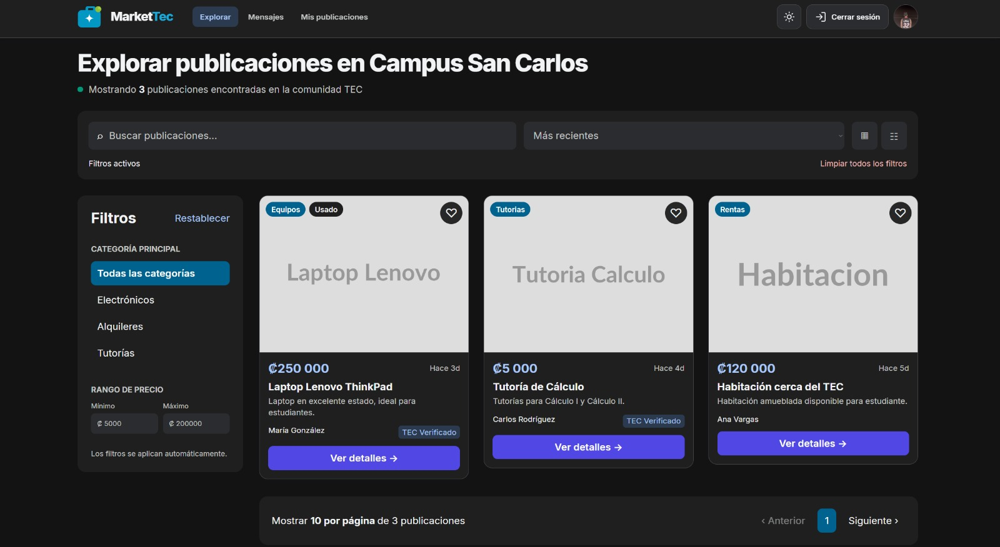
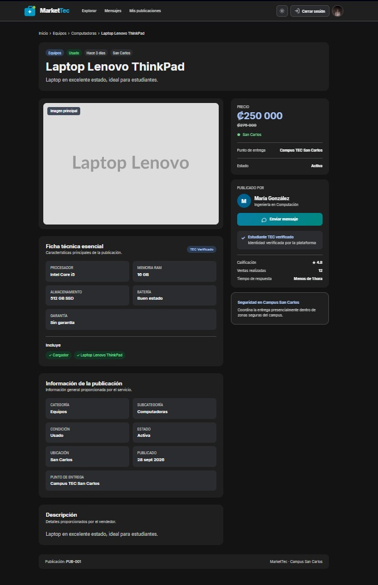
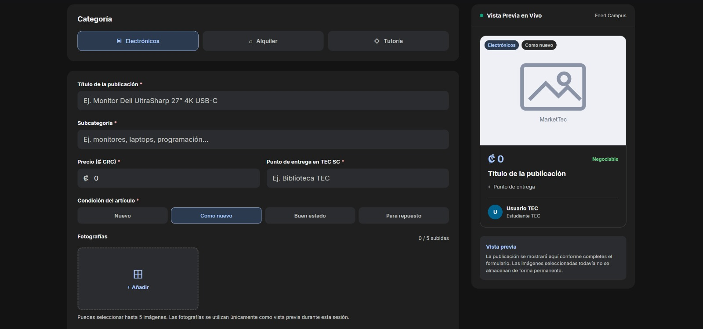
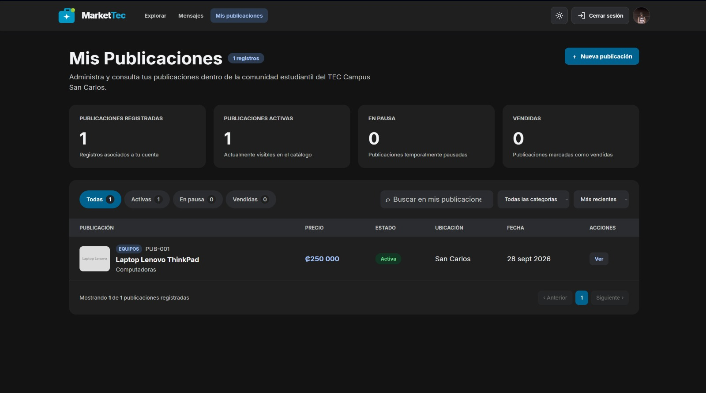
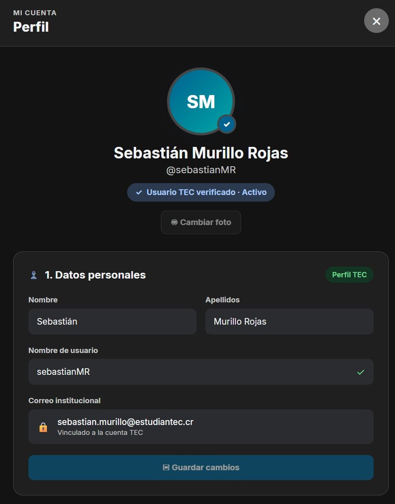
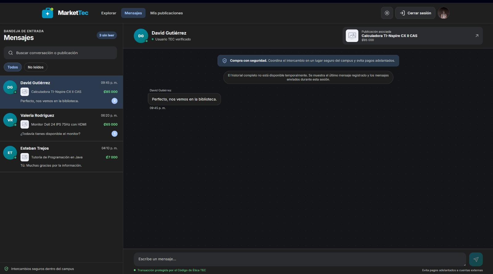

# MarketTec

Marketplace universitario para la comunidad del **Tecnológico de Costa Rica, Campus San Carlos**.

**Curso:** Diseño de Software  
**Proyecto:** Proyecto Programado I - Aplicación Web  
**Fase:** Fase I

---

## 1. Descripción del proyecto

**MarketTec** es una aplicación web responsive orientada a la comunidad del TEC Campus San Carlos. Su propósito es facilitar la publicación, consulta y gestión de productos y servicios dentro de la comunidad universitaria.

Durante la **Fase I**, la aplicación funciona sin un backend real y consume **Mock Services configurados en Azure API Management (APIM)**.

Entre las funcionalidades desarrolladas se encuentran:

- Inicio y catálogo de publicaciones.
- Búsqueda y filtros.
- Consulta del detalle de una publicación.
- Creación de publicaciones.
- Consulta de publicaciones propias.
- Perfil de usuario.
- Mensajería.
- Pantalla de login.
- Validación de formularios.
- Manejo visual de errores y estados de carga.
- Diseño responsive para escritorio y dispositivos móviles.

### Tecnologías principales

- Angular 22
- TypeScript
- RxJS
- Vitest
- Node.js 24
- npm
- Azure API Management
- Azure Static Web Apps
- GitHub Actions
- Git / GitHub
- Figma/Stitch
- Draw.io

---

## 2. Instrucciones de despliegue local

### Requisitos previos

Antes de ejecutar el proyecto localmente se debe contar con:

- Git
- Node.js 24
- npm
- NVM recomendado
- Acceso válido a la API de Azure API Management
- Subscription key válida para APIM

### 2.1 Clonar el repositorio

```bash
git clone <https://github.com/a-calderon-org/market_tec.git>
cd market_tec
```

### 2.2 Seleccionar la versión de Node.js

Desde la raíz del repositorio:

```bash
nvm use
```

Si la versión todavía no se encuentra instalada:

```bash
nvm install
nvm use
```

### 2.3 Entrar al frontend

```bash
cd app/frontend
```

### 2.4 Instalar dependencias

```bash
npm ci
```

### 2.5 Configurar el archivo de entorno

El archivo real de entorno no debe incluirse en Git.

Use como referencia:

```text
src/environments/environment.example.ts
```

Cree el archivo:

```text
src/environments/environment.ts
```

La configuración debe apuntar a:

```text
https://markettec-api.azure-api.net/v1
```

y debe incluir una subscription key válida para Azure API Management.

> No se deben publicar llaves, tokens o secretos dentro del repositorio.

### 2.6 Ejecutar el proyecto

```bash
npm start
```

También se puede utilizar:

```bash
npx ng serve
```

La aplicación estará disponible normalmente en:

```text
http://localhost:4200/
```

### 2.7 Ejecutar pruebas

```bash
npx ng test --watch=false
```

### 2.8 Generar build de producción

```bash
npm run build
```

El build se genera en:

```text
app/frontend/dist/market-tec-frontend
```

---

## 3. Capturas de pantalla

Las capturas utilizadas en esta sección deben almacenarse en:

```text
app/frontend/docs/screenshots/
```

### Login



### Inicio



### Detalle de publicación



### Crear publicación



### Mis publicaciones



### Perfil de usuario



### Mensajería



> Antes de la entrega se debe verificar que todas las imágenes existan y se visualicen correctamente en GitHub.

---

## 4. Estructura del repositorio

```text
market_tec/
├── .github/
│   └── workflows/
│
├── app/
│   ├── frontend/
│   │   ├── public/
│   │   │   └── images/
│   │   │
│   │   ├── src/
│   │   │   ├── app/
│   │   │   │   ├── core/
│   │   │   │   │   └── api/
│   │   │   │   │       ├── api-client.service.ts
│   │   │   │   │       └── api-key.interceptor.ts
│   │   │   │   │
│   │   │   │   ├── features/
│   │   │   │   │   ├── auth/
│   │   │   │   │   ├── home/
│   │   │   │   │   ├── messenger/
│   │   │   │   │   ├── profile/
│   │   │   │   │   └── publications/
│   │   │   │   │
│   │   │   │   └── shared/
│   │   │   │
│   │   │   └── environments/
│   │   │
│   │   ├── angular.json
│   │   ├── package.json
│   │   └── package-lock.json
│   │
│   └── backend/
│       └── [reservado para fase posterior]
│
├── .nvmrc
├── .gitignore
└── README.md
```

### Descripción de las carpetas principales

- `app/frontend`: aplicación web desarrollada en Angular.
- `src/app/core/api`: cliente HTTP e interceptor utilizado para consumir APIM.
- `src/app/features/auth`: funcionalidad de login.
- `src/app/features/home`: pantalla principal, catálogo y filtros.
- `src/app/features/publications`: creación, detalle y administración de publicaciones.
- `src/app/features/profile`: perfil del usuario.
- `src/app/features/messenger`: conversaciones y envío de mensajes.
- `src/app/shared`: elementos reutilizables.
- `.github/workflows`: pipelines de GitHub Actions.
- `app/backend`: reservado para una fase posterior; no forma parte del flujo activo de la Fase I.

---

## 5. Créditos de herramientas y librerías

Este proyecto utiliza las siguientes herramientas y tecnologías:

| Herramienta / Librería | Uso |
| --- | --- |
| Angular | Desarrollo del frontend |
| TypeScript | Lenguaje principal del frontend |
| RxJS | Programación reactiva |
| Vitest | Pruebas unitarias |
| Node.js | Entorno de ejecución para desarrollo |
| npm | Gestión de dependencias |
| Azure API Management | Mock Services y acceso a API |
| Azure Static Web Apps | Alojamiento de la aplicación |
| GitHub Actions | Integración y despliegue continuo |
| GitHub | Control de versiones y repositorio |
| Git | Control de versiones local |
| Figma/Stitch | Diseño de interfaces y prototipos |
| Draw.io | Diagramas de arquitectura |
| Postman | Pruebas manuales de endpoints |

---

## Integrantes

| Integrante | Responsabilidades |
| --- | --- |
| `Allan Calderón` | `Desarrollo del frontend y estructura del proyecto` |
| `Yovelky Delgado` | `Gestión de Azure API y UX/UI` |
| `Sebastian Vargas` | `Implementación Login y documentación del proyecto` |

---

## Nota sobre la Fase I

La Fase I utiliza Mock Services en Azure API Management y no incluye un backend real con persistencia permanente.

Los detalles técnicos adicionales del proyecto se documentan por separado utilizando la plantilla oficial de la Unidad de Computación.
